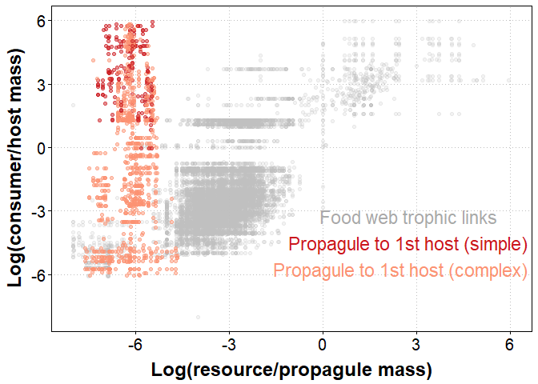

# The relationship between parasite propagules and their hosts

This repository contains an analysis of parasite propagules in the context of food webs. The goal of the analysis is to try to understand how parasite life cycles evolved, and more specifically the utility of first hosts in the life cycle. Are propagules more likely to be ingested by first hosts than by other hosts in the cycle? Several data files are included: a life cycle database (both host and life history data), a collation of host body masses, and a database of food web trophic links. The readable analysis is found in [propagule_transmission.md](propagule_transmission.md).

