Parasite propagule transmission
================

**Background**: I examine how the propagules of parasitic worms fit into food webs. I combine data on [parasite life cycles](http://onlinelibrary.wiley.com/doi/10.1002/ecy.1680/suppinfo), propagule sizes, host body masses, and [size-structured food webs](http://onlinelibrary.wiley.com/doi/10.1890/0012-9658(2006)87%5B2411:CBRINF%5D2.0.CO;2/full). I then plot the data to gauge how propagule-consumer size relationships compare to prey-predator ones. My goal is to understand why certain hosts are the first hosts in parasite complex life cycles, as opposed to second hosts or the only hosts in a simple life cycle.

**Analysis** First, import the libraries and host data from the life cycle database.

``` r
library(dplyr)
library(ggplot2)
library(tidyr)
library(RColorBrewer)

options(stringsAsFactors = FALSE) #never have species lists as factors; always as character vectors

# theme for plots
theme.o <- theme_update(axis.text = element_text(colour="black", size = 15),
                        axis.title = element_text(colour="black", size = 18, face = "bold", lineheight=0.25),
                        axis.ticks = element_line(colour="black"),
                        panel.border = element_rect(colour = "black",fill=NA),
                        panel.grid.minor=element_blank(),
                        panel.grid.major=element_line(color="gray",linetype = "dotted"),
                        panel.background= element_rect(fill = NA))

#import host data
dataH <- read.csv(file="data/CLC_database_hosts.csv", header = TRUE, sep=",")
```

For each parasite species, there is a list of hosts. We need to rearrange the host lists as trophic links exploited by (or potentially exploited by) the parasite. For example, all the host species known to be 1st hosts for parasite A may be consumed by all the 2nd hosts of parasite A. We load a few functions to do this. On a species by species basis, they create and label the potential trophic links exploited by a parasite, e.g. "propagule to 1st host", "1st host to 2nd host", etc.

``` r
source("src/make_trophic_links_functions.R")
```

We loop through all the parasite species, create the trophic links in the life cycle, and then collate them together into a large trophic links data table.

``` r
# loop through parasite species to get trophic links dataset
para.sp <- sort(unique(dataH$Parasite.species))

for(i in seq_along(para.sp)){
  if(i==1) {
    tl.out <- label.trophic.links(para.sp[i])
    tl.out$Parasite.species <- para.sp[i]
  } else {
    tl.out2 <- label.trophic.links(para.sp[i])
    tl.out2$Parasite.species <- para.sp[i]
    tl.out <- rbind(tl.out,tl.out2)
  }
}
rm(para.sp, i, tl.out2) # unneeded after loop
```

Add parasite life cycle length to trophic links table.

``` r
lcl <- group_by(dataH, Parasite.species)%>%
  summarize(lcl = max(Host.no))
tl.out <- left_join(tl.out, lcl)
```

Import host mass data (~20,000 species), compiled from a variety of sources, and then add host masses to the trophic link table.

``` r
# load size data
host.size <- read.csv(file="data/collated_host_mass_data.csv", header = TRUE, sep=",")

# host size either a length or a mass; restrict to just masses
host.size <- filter(host.size, !is.na(body.mass))%>%
  select(binomial, body.mass)%>%
  group_by(binomial)%>%
  summarize(body.mass = mean(body.mass)) # some species have multiple entries, so avg them

# add consumer mass
tl.out$cons.mass<-
  host.size$body.mass[match(tl.out$cons, host.size$binomial)]
# add resource mass
tl.out$res.mass<-
  host.size$body.mass[match(tl.out$res, host.size$binomial)]
```

The trophic link table also includes 'parasite propagule to host consumer' entries, and we want to add parasite propagule masses to these trophic links. We import the parasite body size data from the life cycle database, restrict it to the propagules, and then convert lengths and widths to biovolume. Here the assumption is that biovolume (mm<sup>3</sup>) can be converted to mass (mg) assuming a tissue density of 1.1 mg/mm<sup>3</sup>. This is then converted to g, as that is the unit used in the host mass data.

``` r
# load helminth life history data
dataL <- read.csv(file="data/CLC_database_lifehistory.csv", header = TRUE, sep=",")

# filter to just propagule stages
dataL <- filter(dataL, Host.no == 0)

# calculate a biovolume (mm3) for worm stages from lengths, widths, and shapes
dataL <- mutate(dataL, biovolume = 
                  if_else(Shape %in% c("cylinder", "thread-like", "whip"), 
                          pi * (Width/2)^2 * Length, # calculate volume as a cylinder
                          if_else(Shape %in% c("coiled", "sphere", "ellipsoid"),
                                  4/3 * pi * Length/2 * Width/4, # calculate volume as a ellipsoid
                                  Length * Width # calculate volume as area for remaining ribbon, leaf shapes
                                  )),
                biovolume = biovolume * 1.1/1000) # covert to biomass with assumed 1.1. g/cm3 tissue density 

dataL <- select(dataL, Parasite.species, Stage, Egg.hatch, biovolume)
```

Several measurements may be given for a parasite propagule, such as the egg, embryo, or hatched larave. We should extract the propagules measurments respresenting what is ingested by the consumer. This is the egg if it does not hatch or the free larva if it does hatch.

``` r
#distinguish species transmitted by either eggs or hatched propagules
prop <- select(dataL, Parasite.species, Egg.hatch)%>%
  filter(!is.na(Egg.hatch))%>%distinct()
prop$selector <- "free larva"
prop$selector[which(prop$Egg.hatch == "eaten")] <- "egg"

#this tags rows that are propagules, but are not the transmission stage (e.g. embryos)
dataL$propagule.selector[
  is.na(match(
    paste(dataL$Parasite.species, dataL$Stage),
    paste(prop$Parasite.species, prop$selector))
    )
  ] <- 1
```

Then, we can average propagule measurements for each parasite species.

``` r
dataL <- filter(dataL, is.na(propagule.selector))%>%
  select(-propagule.selector, -Egg.hatch)%>%
  group_by(Parasite.species, Stage)%>%
  summarize(biovolume = mean(biovolume, na.rm=T))%>%
  filter(!is.nan(biovolume))
```

And we add it to the trophic link dataset.

``` r
# match propagule masses to parasite species in trophic link data
eggies <- dataL$biovolume[match(tl.out$Parasite.species, dataL$Parasite.species)]
# restrict to just propagule stages and add to trophic link data
eggies <- eggies[which(tl.out$res=='propagule')]
tl.out$res.mass[which(tl.out$res=='propagule')] <- eggies
```

To compare how parasite-exploited trophic links compare to the normal links in food-webs, we import a database of food web links [(Brose et al. 2006)](http://onlinelibrary.wiley.com/doi/10.1890/0012-9658(2006)87%5B2411:CBRINF%5D2.0.CO;2/full). The data is mostly predator-prey links, and quite a lot of mass data is missing (4400 of 16800 links, ~ 26%)

``` r
brose<-read.csv(file="data/Brose_bodysizes_2008_DB.csv", header = TRUE,sep = ",")

# plot data to show different kinds of trophic interactions
ggplot(data = brose,
       aes(x = log10(Mean.mass..g..resource),
           y = log10(Mean.mass..g..consumer),
           color = Type.of.feeding.interaction)) +
  geom_point(alpha = 0.2) +
  labs(x = "\nLog(resource mass)", y = "Log(consumer mass)\n") +
  scale_x_continuous(limits = c(-8, 6), breaks = seq(from = -6, to = 6, by = 3))
```

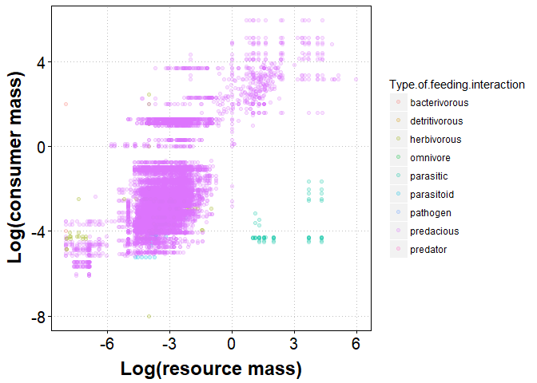

The links with missing mass data nonetheless have consumer-resource mass ratios. Brose et al. say that these masses were calculated from length allometries, but I am unsure about how to back calculate masses, as the allometric relationships were not given. The links with missing masses show a wider spread in mass ratios, especially large ratios (i.e. big consumers, small resources). Thus, grazing or detritivorous interactions are probably overrepresented among the missing values.

``` r
# look at missing data
brose <- mutate(brose, missing_mass = if_else(is.na(Mean.mass..g..resource), 1, 
                                              if_else(is.na(Mean.mass..g..consumer), 1, 0)))

ggplot(brose, aes(x = factor(missing_mass), y = log10(Consumer.resource.body.mass.ratio))) +
  geom_boxplot() +
  labs(x = "Missing, 1 = yes", y = "Log(Cons/Res Mass Ratio")
```

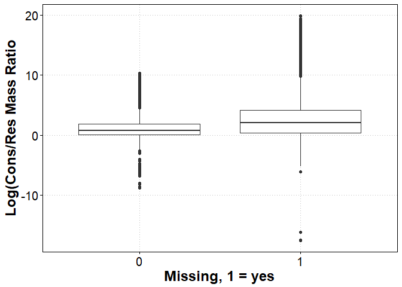

For the sake of simplicity, we'll ignore the missing mass data for now, but we should keep it in mind, and maybe consider larger [datasets](http://www.globalbioticinteractions.org/about.html) in the future.

Let's eliminate a few interaction types that are obviously not exploited by trophically-transmitted helminths (e.g. parasitoid) and then combine the food web and parasite trophic links data into a single data frame for plotting.

``` r
# remove certain feeding type
brose <- filter(brose, !(Type.of.feeding.interaction %in% c("parasitic", "parasitoid", "pathogen")))
# add var for combining with tl.out
brose$Parasite.species <- "not applicable"
brose$trans.step <- "food web"
brose$lcl <- "not applicable"
brose <- select(brose, Parasite.species, cons.mass = Mean.mass..g..consumer,
                 res.mass = Mean.mass..g..resource, trans.step, lcl)
# combine into single data frame
plot.dat <- select(tl.out, Parasite.species, cons.mass, res.mass, trans.step, lcl)
plot.dat <- rbind(plot.dat, brose)
```

Now, we'll create a series of plots with parasite data overlaid on the food web data. The basic plot is consumer/predator size on the y-axis and resource/prey size on the x-axis. First, we plot links where the parasite propagule is transmitted to the 1st host. Parasite propagules are tiny, but they infect just about anything; they cover 10 orders of magnitude on the y-axis! The smallest ones overlap the food web data well.

``` r
reds <- brewer.pal(9, 'Reds')[6]
ggplot(data = filter(plot.dat, trans.step=="food web"),
       aes(x = log10(res.mass), y = log10(cons.mass))) +
  geom_point(color = "gray", alpha = 0.2) +
  labs(x = "\nLog(resource/propagule mass)", y = "Log(consumer/host mass)\n") +
  geom_point(data = filter(plot.dat, trans.step=="propagule to 1st host"), 
             aes(x = log10(res.mass), y = log10(cons.mass)),
             color = reds, alpha = 0.2) +
  annotate("text", x = 2.75, y = -3.75, label = "Food web trophic links",
           size = 6, color = "darkgray") +
  annotate("text", x = 2.75, y = -5.5, label = "Propagule to 1st host", 
           size = 6, color = reds) +
  scale_x_continuous(limits = c(-8, 6), breaks = seq(from = -6, to = 6, by = 3)) +
  scale_y_continuous(limits = c(-8, 6), breaks = seq(from = -6, to = 6, by = 3))
```

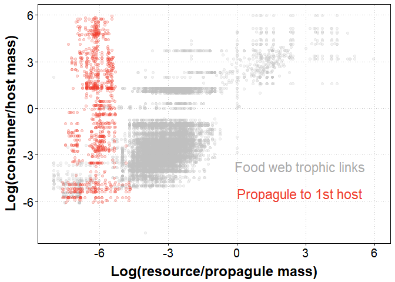

Let's make a second version of the plot, but separate simple and complex life cycles (i.e. parasites that have one host vs multiple hosts in their life cycle). Clearly, worms with simple cycles tend to have bigger 1st hosts.

``` r
plot.dat <- mutate(plot.dat, lcl.cat = if_else(lcl > 1, "complex", "simple")) 
reds <- brewer.pal(9, 'Reds')[c(4,7)]

outfig <- ggplot(data = filter(plot.dat, trans.step=="food web"),
                 aes(x = log10(res.mass), y = log10(cons.mass))) +
  geom_point(color = "gray", alpha = 0.2) +
  labs(x = "\nLog(resource/propagule mass)", y = "Log(consumer/host mass)\n") +
  geom_point(data = filter(plot.dat, trans.step == "propagule to 1st host"), 
             aes(x = log10(res.mass), y = log10(cons.mass), color = lcl.cat),
             alpha = 0.5) +
  scale_color_manual(values = reds) + guides(color=FALSE) +
  annotate("text", x = 2.75, y = -3.25, label = "Food web trophic links",
           size = 6, color = "darkgray") +
  annotate("text", x = 2.75, y = -4.5, label = "Propagule to 1st host (simple)", 
           size = 6, color = reds[2]) +
  annotate("text", x = 2.5, y = -5.75, label = "Propagule to 1st host (complex)", 
           size = 6, color = reds[1]) +
  scale_x_continuous(limits = c(-8, 6), breaks = seq(from = -6, to = 6, by = 3)) +
  scale_y_continuous(limits = c(-8, 6), breaks = seq(from = -6, to = 6, by = 3))
outfig
```

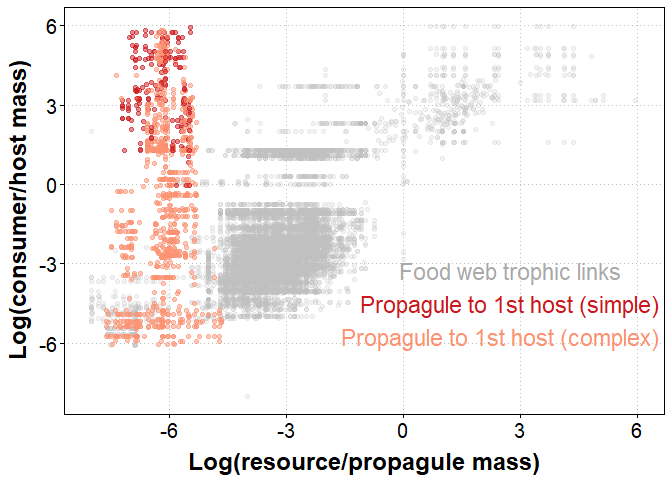

``` r
# save svg and png of fig for a word doc; add (A) for paneling, change color of axis text
ggsave(filename = "figs/prop_to_1sthost_foodweb.png", width = 7, height = 5, units = "in")
ggsave(filename = "figs/prop_to_1sthost_foodweb.svg", width = 7, height = 5, units = "in")
```

We can make finer distinctions between parasite life cycles. Instead of simple vs complex, let's try the life cycle groups: one-host, two-host, and three or more-hosts. The pattern is still distinguishable. Parasites with long life cycles tend to infect smaller first hosts. However, the differences between 2- and 3-host parasites is not obvious, so I would not prefer this plot over the simpler previous one.

``` r
plot.dat <- mutate(plot.dat, lcl.cat = if_else(lcl == 1, "1 host", if_else(lcl == 2, "2 hosts", ">2 hosts")))
reds <- brewer.pal(9, 'Reds')[c(3, 9, 6)]

outfig <- ggplot(data = filter(plot.dat, trans.step=="food web"),
                 aes(x = log10(res.mass), y = log10(cons.mass))) +
  geom_point(color = "gray", alpha = 0.2) +
  labs(x = "\nLog(resource/propagule mass)", y = "Log(consumer/host mass)\n") +
  geom_point(data = filter(plot.dat, trans.step == "propagule to 1st host"), 
             aes(x = log10(res.mass), y = log10(cons.mass), color = lcl.cat),
             alpha = 0.5) +
  scale_color_manual(values = reds) + guides(color=FALSE) +
  annotate("text", x = 2.75, y = -3.25, label = "Food web trophic links",
           size = 6, color = "darkgray") +
  annotate("text", x = 2.75, y = -4.5, label = "Propagule to 1st host (1-host cycle)", 
           size = 6, color = reds[2]) +
  annotate("text", x = 2.5, y = -5.75, label = "Propagule to 1st host (2-host cycle)", 
           size = 6, color = reds[3]) +
  annotate("text", x = 2.75, y = -6.75, label = "Propagule to 1st host (>2-host cycle)", 
           size = 6, color = reds[1]) +
  scale_x_continuous(limits = c(-8, 6), breaks = seq(from = -6, to = 6, by = 3)) +
  scale_y_continuous(limits = c(-8, 6), breaks = seq(from = -6, to = 6, by = 3))
outfig
```

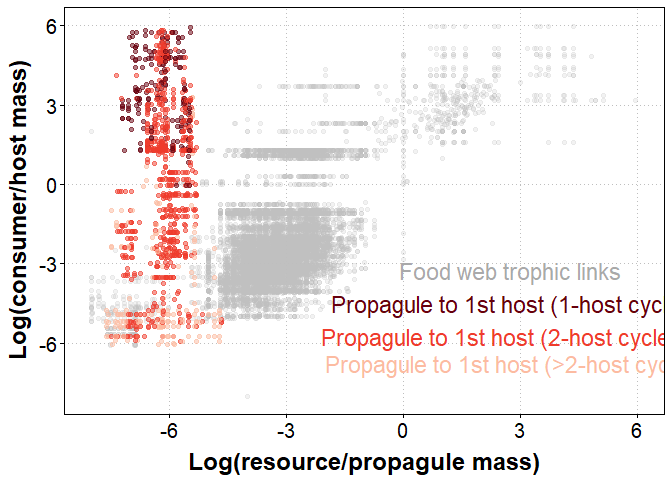

Now imagine that complex life cycle parasites skipped their first hosts, i.e. their propagules are consumed by the second hosts instead. How likely is this? When we make a similar plot to the previous one, we see there is much less overlap between parasite and food web data. This indicates that parasite propagules are usually too small to be considered a normal food item for the second hosts in a complex life cycle, and this indirectly supports the idea that transmission to the first host is higher than to the second host. Stated in another way, the first host reduces the mortality of the propagule.

``` r
blues <- brewer.pal(9, 'Blues')[6]
outfig <- ggplot(data = filter(plot.dat, trans.step=="food web"),
                 aes(x = log10(res.mass), y = log10(cons.mass))) +
  geom_point(color = "gray", alpha = 0.2) +
  labs(x = "\nLog(resource/propagule mass)", y = "Log(consumer/host mass)\n") +
  geom_point(data = filter(plot.dat, trans.step=="propagule to 2nd host"), 
             aes(x = log10(res.mass), y = log10(cons.mass)),
             color = blues, alpha = 0.2) +
  annotate("text", x = 2.75, y = -3.25, label = "Food web trophic links",
           size = 6, color = "darkgray") +
  annotate("text", x = 2.75, y = -4.5, label = "Propagule to 2nd host", 
           size = 6, color = blues) +
  scale_x_continuous(limits = c(-8, 6), breaks = seq(from = -6, to = 6, by = 3)) +
  scale_y_continuous(limits = c(-8, 6), breaks = seq(from = -6, to = 6, by = 3))
outfig
```

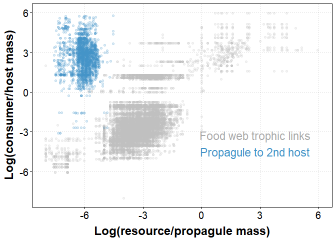

``` r
# save svg and png of fig for a word doc; add (B) for paneling, change color of axis text
ggsave(filename = "figs/prop_to_2ndhost_foodweb.png", width = 7, height = 5, units = "in")
ggsave(filename = "figs/prop_to_2ndhost_foodweb.svg", width = 7, height = 5, units = "in")
```

The role of the first host is not only to eat the propagule, but also to transmit the parasite to the 2nd host. Thus, we expect trophic links of the first host to the second host to fall solidly within the range of the food web data. That is mostly the case, but there are also some cases with small 1sts hosts being transmitted to especially large 2nd hosts.

``` r
purp <- brewer.pal(9, 'Purples')[7]
ggplot(data = filter(plot.dat, trans.step=="food web"),
       aes(x = log10(res.mass), y = log10(cons.mass))) +
  geom_point(color = "gray", alpha = 0.2) +
  labs(x = "\nLog(resource/propagule mass)", y = "Log(consumer/host mass)\n") +
  geom_point(data = filter(plot.dat, trans.step=="1st host to 2nd host"), 
             color = purp, alpha = 0.2) +
  annotate("text", x = 2.75, y = -3.25, label = "Food web trophic links",
           size = 6, color = "darkgray") +
  annotate("text", x = 2.75, y = -4.5, label = "1st host to 2nd host", 
           size = 6, color = purp) +
  scale_x_continuous(limits = c(-8, 6), breaks = seq(from = -6, to = 6, by = 3)) +
  scale_y_continuous(limits = c(-8, 6), breaks = seq(from = -6, to = 6, by = 3))
```

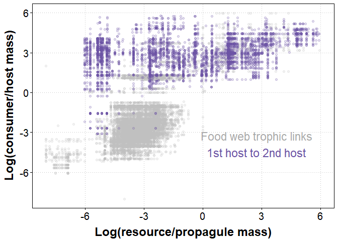

These plots are sufficient for now, but they might be improved by changing the food web data to a heat map or a contour plot.

It seems like small first hosts are both likely to eat propagules and be eaten by a 2nd host. But starting in small hosts may have a downside: longer life cycles. It may take several steps from a small first host to reach a host in which it is suitable to reproduce. Let's check the relationship between first host mass and life cycle length. First, we combine the host data with the body mass data, and we run a linear regression. There is a significant negative correlation.

``` r
lclvsprop <- left_join(dataH, host.size, by = c("Host.species" = "binomial"))%>% # add host mass
  group_by(Parasite.species, Host.no)%>%
  summarize(host.mass = mean(body.mass, na.rm=T))%>% # calc avg host size for each parasite stage
  left_join(lcl) # add lcl

# sig neg correlation between life cycle length and 1st host mass
summary(lm(lcl ~ log(host.mass), filter(lclvsprop, Host.no == 1)))
```

    ## 
    ## Call:
    ## lm(formula = lcl ~ log(host.mass), data = filter(lclvsprop, Host.no == 
    ##     1))
    ## 
    ## Residuals:
    ##     Min      1Q  Median      3Q     Max 
    ## -0.9576 -0.3431 -0.1396  0.3585  1.8107 
    ## 
    ## Coefficients:
    ##                 Estimate Std. Error t value Pr(>|t|)    
    ## (Intercept)     1.951656   0.023401   83.40   <2e-16 ***
    ## log(host.mass) -0.056595   0.002759  -20.51   <2e-16 ***
    ## ---
    ## Signif. codes:  0 '***' 0.001 '**' 0.01 '*' 0.05 '.' 0.1 ' ' 1
    ## 
    ## Residual standard error: 0.5335 on 538 degrees of freedom
    ##   (433 observations deleted due to missingness)
    ## Multiple R-squared:  0.4389, Adjusted R-squared:  0.4378 
    ## F-statistic: 420.8 on 1 and 538 DF,  p-value: < 2.2e-16

Then we visualize the correlation. It is clearly negative, although for a given life cycle length, first host size can vary substantially.

``` r
outfig <- ggplot(filter(lclvsprop, Host.no == 1),
                 aes(x = log10(host.mass), y = lcl)) +
  geom_point(alpha = 0.2) +
  geom_smooth(method = 'lm', se = F, color = 'dark gray') +
  labs(y = "Life cycle length", x = "1st host mass")
outfig
```

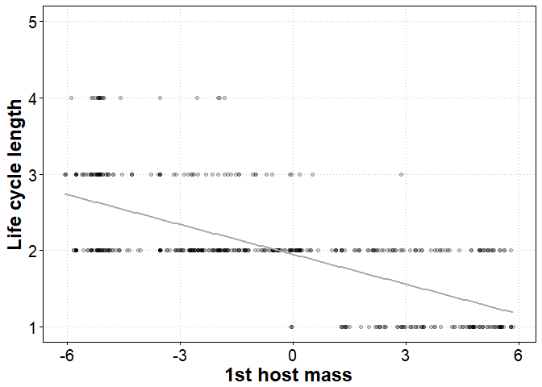

``` r
# save this for a word doc
ggsave(filename = "figs/lcl_vs_1hostmass.png", width = 5, height = 4.5, units = "in")
```

Maybe a boxplot is better than a scatterplot, given the limited range of values that life cycle length can take, so let's make one.

``` r
lclvsprop <- mutate(lclvsprop, lcl.cat = if_else(lcl > 3, ">3", as.character(lcl)))%>%
  mutate(lcl.cat = factor(lcl.cat, levels = c("1", "2", "3", ">3")))

outfig <- ggplot(filter(lclvsprop, Host.no == 1),
                 aes(y = log10(host.mass), x = lcl.cat)) +
  geom_boxplot(outlier.color = "white", width = 0.9) +
  geom_jitter(width = 0.2, color = "red", alpha = 0.2) +
  labs(x = "Life cycle length", y = "1st host mass")
outfig
```

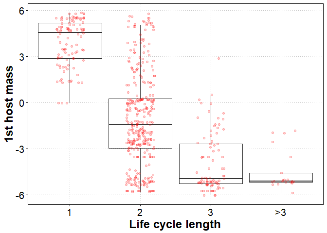

This is clearer in my opinion. We can also try to integrate food web info onto this boxplot. Let's shade the area where propagule sizes overlap with the Brose food web data. We'll take the inner 95% quantiles to exclude odd parasite propagules and odd trophic links. Then we'll shade the plot to indicate which hosts seem likely to consume parasite propagules.

``` r
prop_size95 <- quantile(dataL$biovolume, probs = c(0.025, 0.975)) # 95% quantile for propagule sizes
# for trophic links with resources in the size range of parasite propagules, take the 95% quantile for consumers
cons_size95 <- filter(brose, res.mass > prop_size95[1], res.mass < prop_size95[2])%>% 
  select(cons.mass)
cons_size95 <- quantile(cons_size95$cons.mass, probs = c(0.025, 0.95))

# add a rectangle to the boxplot depicting where propagule consumption is realistic
outfig <- outfig +
  annotate(geom = "rect",
           xmin = 0.4, xmax = 4.6,
           ymin = log10(cons_size95[1]),
           ymax = log10(cons_size95[2]),
           fill = 'gray', alpha = 0.2) + 
  scale_x_discrete(expand = c(0,0))
outfig
```

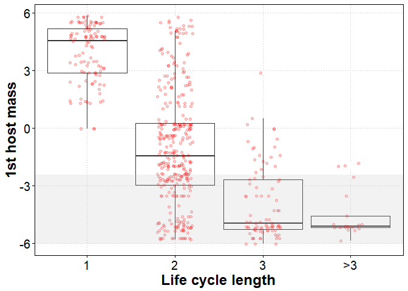

``` r
# save this
ggsave(filename = "figs/lcl_vs_1hostmass_boxplot.png", width = 5, height = 4.5, units = "in")
```

This plot suggests that only complex life cycle parasites have 1st hosts that are likely to consume parasite propagules.

Presumably, parasites adapt to their life cycles and hosts. Thus, although parasite propagules are consistently small, maybe their size correlates with the type of first host. For example, perhaps larger propagules are more likely to be eaten by bigger consumers. Consistent with this, there is a significant positive correlation between propagule mass and 1st host mass.

``` r
lclvsprop <- left_join(lclvsprop, dataL) # combine host size and propagule data

# sig pos correlation between propagule size and 1st host mass
summary(lm(log(host.mass) ~ log(biovolume), filter(lclvsprop, Host.no == 1)))
```

    ## 
    ## Call:
    ## lm(formula = log(host.mass) ~ log(biovolume), data = filter(lclvsprop, 
    ##     Host.no == 1))
    ## 
    ## Residuals:
    ##      Min       1Q   Median       3Q      Max 
    ## -13.8441  -5.9802  -0.5884   5.9149  16.5128 
    ## 
    ## Coefficients:
    ##                Estimate Std. Error t value Pr(>|t|)    
    ## (Intercept)     13.1243     4.2685   3.075 0.002246 ** 
    ## log(biovolume)   1.0403     0.2985   3.485 0.000544 ***
    ## ---
    ## Signif. codes:  0 '***' 0.001 '**' 0.01 '*' 0.05 '.' 0.1 ' ' 1
    ## 
    ## Residual standard error: 7.672 on 417 degrees of freedom
    ##   (554 observations deleted due to missingness)
    ## Multiple R-squared:  0.0283, Adjusted R-squared:  0.02597 
    ## F-statistic: 12.15 on 1 and 417 DF,  p-value: 0.000544

When we visualize the correlation, though, we see that it is weak. Parasite propagules of a given size can go into hosts that range over 10 orders of magnitude in size. Thus, I am not ready to claim that propagule sizes increase when the first host is larger.

``` r
ggplot(filter(lclvsprop, Host.no == 1),
       aes(x = log10(biovolume), y = log10(host.mass))) +
  geom_point(alpha = 0.2) +
  geom_smooth(method = 'lm', se = F, color = 'dark gray') +
  labs(x = "Propagule mass", y = "1st host mass")
```

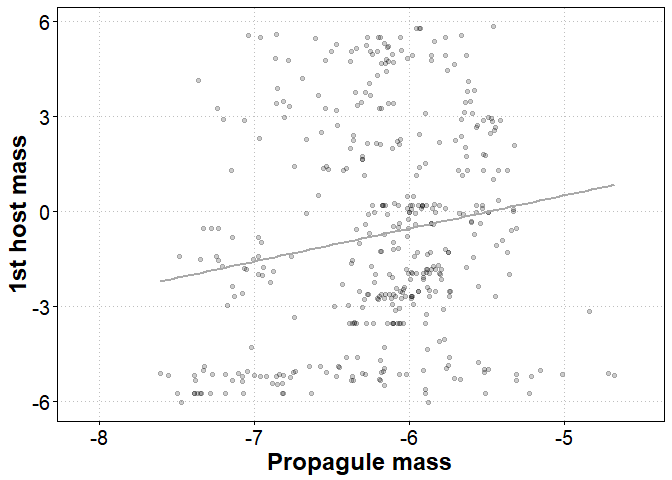

There are 973 parasite species in the life cycle database. It is worth checking how many have 1st host size data and propagule size data. About 44% lack host size data.

``` r
lclvsprop2 <- filter(lclvsprop, Host.no == 1)%>%
  mutate(missing_hostsize = if_else(is.na(host.mass), 'no 1st host size', '1st host size available'),
         missing_propsize = if_else(is.na(biovolume), 'no propagule size', 'propagule size available'))
table(lclvsprop2$missing_hostsize)
```

    ## 
    ## 1st host size available        no 1st host size 
    ##                     540                     433

As vertebrate body sizes are more readily available than invertebrate sizes, it is likely that small first hosts are underrepresented in the consumer-resource plots above.

Less propagule size data is missing. Only 27% of species lack propagule size data. The presence or absence of propagule sizes is presumably randomly distributed, because reporting these data (or not) probably does not strongly depend on propagule size.

``` r
table(lclvsprop2$missing_propsize)
```

    ## 
    ##        no propagule size propagule size available 
    ##                      263                      710
